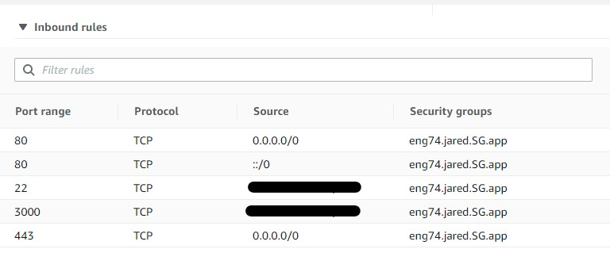
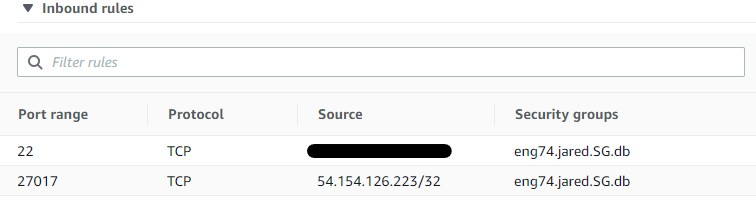
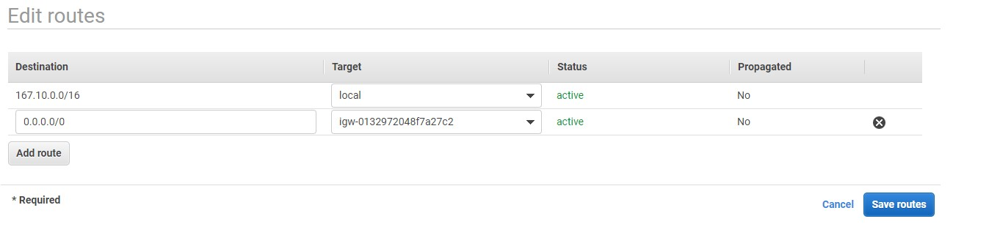
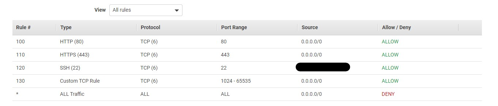
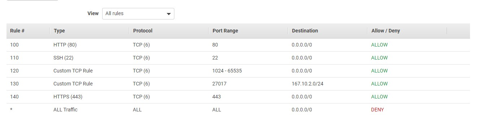
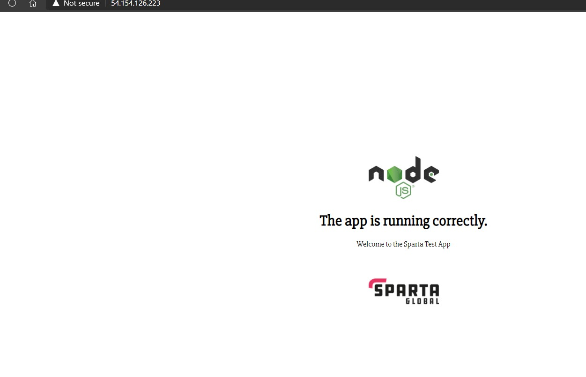
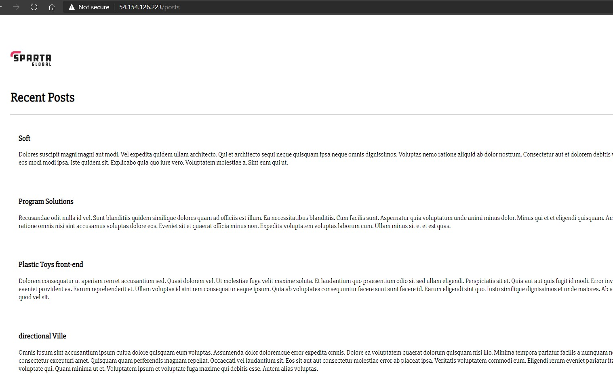
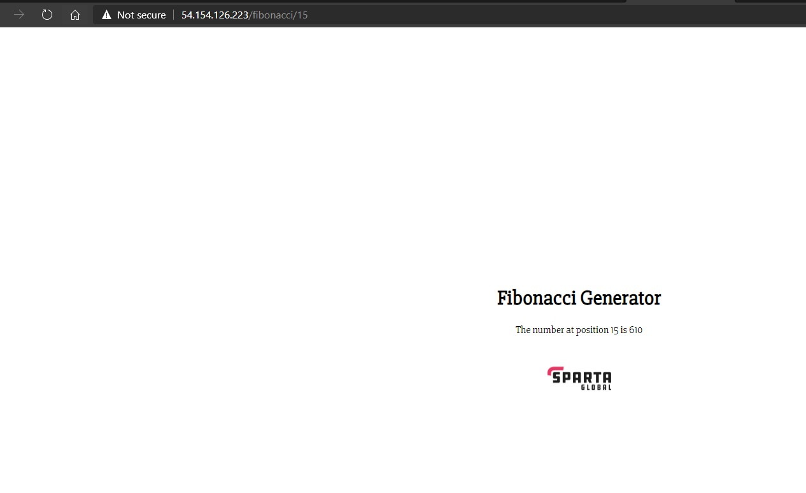

# VPC's

## What is it?
- VPC stands for a "Virtual Private Cloud"

- It is an on-demand virtual network, it allows you to launch AWS services into a virtual network.This virtual network closely resembles a traditional network that you'd operate in your own data center, with the benefits of using the scalable infrastructure of AWS.

 

## How do we set one up?
- We need to go to services, and find `VPC`

- On the left-hand side select `Your VPCs` and on the top right-hand corner select `Create VPC`

- Give it a name and a relevant IPv4 CIDR block
    - For a possible one, you can try `123.14.0.0/16`

- You can choose to add an IPv6 address but it's not necessary

- After these steps, click `Create VPC` at the bottom

 

## Internet Gateways
- We now need to make an internet gateway. This is a virtual router that will connect your VPC to the internet

- In the same sections as the previous, select `Internet Gateways` on the left-hand navigation bar

- On the top right-hand corner click `Create internet gateway`

- Give it a logical name like `IGW-for-VPC`

- Click `Create internet gateway`

 

## Creating subnets
- Now that we have our own VPC, we can further configure it by creating two subnets inside it -- one that acts as a public network (to host our app) and another to act as a private network (for our database)
    - We need to do this because there are conflicting requirements for the app and database
    - On one hand people need to be able to access the app wherever they are
    - On the other, we have the database that would potentially store sensitive information and will necessarily require the minimum amount of access to it

- To create a subnet, look towards the left-hand navigation bar and select `Subnets` in the `Virtual Private Cloud` section

- Click on the top right-hand corner labelled `Create subnet`

- We are creating a subnet within our VPC so the first step is to select the VPC we have just made in the drop-down

- Next we will need to create two subnets, let's create the public one first:
    - Click `Add new subnet`
    - Give it a logical name e.g. `Public-Subnet`
    - The `Availability Zone` isn't too important so you can choose to keep it at no preference
    - Next, give the network a subnet mask (you will need to look up how this works etc.)
    - Then you are done!

- We now need to create our private subnet, so select `Add a new subnet` just below the one before
    - Copy the exact same steps
    - Give it a logical name also e.g. `Private-Subnet`

- Finally, select `Create subnet` at the bottom right-hand corner

 

## Creating EC2 instances within these subnets
- As mentioned before, we will now need to create two instances -- one to run our app and another for our database

- Like before, we need to navigate to the EC2 instances and create our own ones

- All the steps are the same as before except for when we reach `Step 3. Configure Instance` and `Step 6. Configure Security Group`.
    - Do remember to give your instance a logical name
    
- In Step 3:
    - We will need to change `Network` to the VPC you have created
    - Change the `Subnet` to the relevant one. I strongly advise creating the app instance first as we will need the IP for it when configuring security groups for our database
    - Remember that the app will be on the public subnet while the database on the private subnet
    - You will also need to ensure that `Auto-assign Public IP` is enabled

- In Step 6:
    - Notice we do not have our previously created security groups. This is due to the fact that we are now inside a different VPC (our own one).
    - It follows that we must create our own security groups again
    - For our app, do the following:
    
        - Of course the two sources for port 22 and port 3000 will need to be your own IP address
    - Now for our database, we will need to do the following:
    
        - Like before, the port 22 source should be your own IP address
        - The port 27017 source should be the IP address of the app instance within your VPC

## Route tables

- We now need to create a route table. It will contain a set of rules, called routes, that determine where the network traffic from your subnet or gateway is directed. We will need to create two -- one for each subnet we have

- From the same section in the navigation bar, select `Route Tables`

- This time, go to the top left-hand corner and select `Create route table`. Let's create both:
    - In the name, input a logical name like `RouteTable-Public-Subnet` or `RouteTable-Private-Subnet`
    - This will be associated with our VPC so select it in the drop-down
    - Click `Create`
    - Do this two times

- You will now have two route tables associated with your VPC

- We now need to associate each one with their respective subnets

- In the list, find the ones you just created and select one of them
    - Click `Subnet Associations` and click `Edit subnet associations` at the top
    - Depending on which one you have clicked, select the relevant subnet
    - e.g. if you clicked the public route table, you need to select the public subnet

- Now we can configure the routes. Let's do the public one first:
    - Click `Routes` and select `Edit routes`
    - This one is easier, since we need to allow anyone in the world access to our app, all we need to do is give `0.0.0.0/0` as our destination and choose the target as the internet gateway you created
    - The first route will always be the local network -- i.e. the network of the VPC
    - It will look like the following
    
    - Then click `Save routes`

- On our private one, this will be a bit more complex:
    - As before, select the route table that is relevant to our private subnet
    - Click `Routes` and select `Edit routes`
    - **The next bit is important**
    - To be able to set-up our database properly, we will need to add `0.0.0.0/0` as a destination and the internet gateway as the target (exactly the same as the public one)
    - Once we create our database instance and correctly set it up, we will need to remove this route and only allow two:
        1. The first one should have the app IP address as a destination and the internet gateway as the target
        2. Your IP address as the destination and the internet gateway as the address (to enable you to SSH in)

 

## Network ACLs or, NACLs
- This stands for `Network access control list`. It's an optional layer of security for the VPC which acts as a firewall that controls the traffic in and out of subnets. All addresses present within a subnet with an NACL will follow these rules.

- As before, go to the left-hand side and in the the `Security` section, select `Network ACLs`

- We will need to create two NACLs -- one for the private subnet and one for the public subnet

- Let's begin with the public one:
    - At the top left-hand corner click `Create network ACL`
    - Give it a logical name like `ACL-Public-Subnet`
    - Select your VPC and click `Create`
    - Now select the newly-created NACL from the list
    - Click on `Inbound rules` and configure it as shown:
    
    - For port 22 access, you will obviously need to input your own IP address for the source
    - For the `Outbound rules`, do it as shown also:
    
    - For rule 130, you will need to input the 

 

## What you should get

- Note firstly that the app will now run within a subnet of our VPC and will have the following address

- If we navigate to the public IP address we will see the following page

- Since we configured our app and database to communicate the posts page should work as well as the fibonacci

