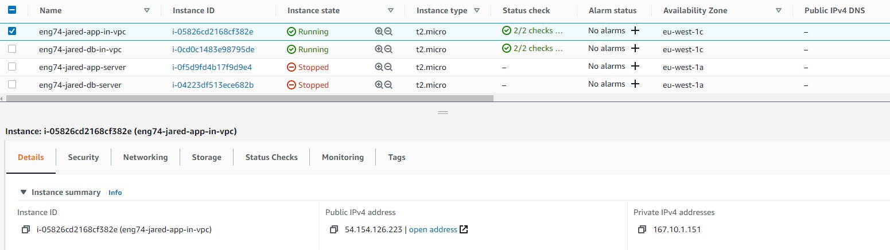

# VPC's

## What is it?
- VPC stands for a "Virtual Private Cloud"

- It is an on-demand virtual network, it allows you to launch AWS services into a virtual network.This virtual network closely resembles a traditional network that you'd operate in your own data center, with the benefits of using the scalable infrastructure of AWS.

 

## How do we set one up?
- We need to go to services, and find `VPC`

- On the left-hand side select `Your VPCs` and on the top right-hand corner select `Create VPC`

- Give it a name and a relevant IPv4 CIDR block
    - For a possible one, you can try `123.14.0.0/16`

- You can choose to add an IPv6 address but it's not necessary

- After these steps, click `Create VPC` at the bottom

 

## Internet Gateways
- We now need to make an internet gateway. This is a virtual router that will connect your VPC to the internet

- In the same sections as the previous, select `Internet Gateways` on the left-hand navigation bar

- On the top right-hand corner click `Create internet gateway`

- Give it a logical name like `IGW-for-VPC`

- Click `Create internet gateway`

 

## Creating subnets
- Now that we have our own VPC, we can further configure it by creating two subnets inside it -- one that acts as a public network (to host our app) and another to act as a private network (for our database)
    - We need to do this because there are conflicting requirements for the app and database
    - On one hand people need to be able to access the app wherever they are
    - On the other, we have the database that would potentially store sensitive information and will necessarily require the minimum amount of access to it

- To create a subnet, look towards the left-hand navigation bar and select `Subnets` in the `Virtual Private Cloud` section

- Click on the top right-hand corner labelled `Create subnet`

- We are creating a subnet within our VPC so the first step is to select the VPC we have just made in the drop-down

- Next we will need to create two subnets, let's create the public one first:
    - Click `Add new subnet`
    - Give it a logical name e.g. `Public-Subnet`
    - The `Availability Zone` isn't too important so you can choose to keep it at no preference
    - Next, give the network a subnet mask (you will need to look up how this works etc.)
    - Then you are done!

- We now need to create our private subnet, so select `Add a new subnet` just below the one before
    - Copy the exact same steps
    - Give it a logical name also e.g. `Private-Subnet`

- Finally, select `Create subnet` at the bottom right-hand corner

 

## Route tables

- We now need to create a route table. It will contain a set of rules, called routes, that determine where the network traffic from your subnet or gateway is directed. We will need to create two -- one for each subnet we have

- From the same section in the navigation bar, select `Route Tables`

- This time, go to the top left-hand corner and select `Create route table`

 

## What you should get

- Note firstly that the app will now run within a subnet of our VPC and will have the following address

- If we navigate to the public IP address we will see the following page

- Since we configured our app and database to communicate the posts page should work as well as the fibonacci

